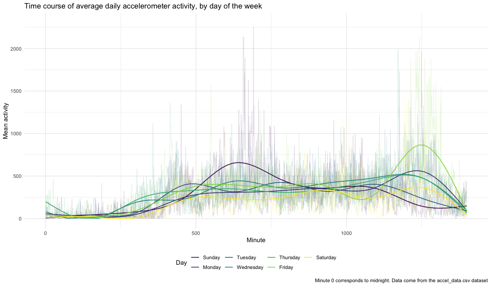

P8105 Homework 3
================
October 15th, 2022

## Problem 1: Instacart Data

We will be working with the “The Instacart Online Grocery Shopping
Dataset 2017”.

### Data overview and description

``` r
data("instacart")
instacart 
```

    ## # A tibble: 1,384,617 × 15
    ##    order_id product_id add_to_…¹ reord…² user_id eval_…³ order…⁴ order…⁵ order…⁶
    ##       <int>      <int>     <int>   <int>   <int> <chr>     <int>   <int>   <int>
    ##  1        1      49302         1       1  112108 train         4       4      10
    ##  2        1      11109         2       1  112108 train         4       4      10
    ##  3        1      10246         3       0  112108 train         4       4      10
    ##  4        1      49683         4       0  112108 train         4       4      10
    ##  5        1      43633         5       1  112108 train         4       4      10
    ##  6        1      13176         6       0  112108 train         4       4      10
    ##  7        1      47209         7       0  112108 train         4       4      10
    ##  8        1      22035         8       1  112108 train         4       4      10
    ##  9       36      39612         1       0   79431 train        23       6      18
    ## 10       36      19660         2       1   79431 train        23       6      18
    ## # … with 1,384,607 more rows, 6 more variables: days_since_prior_order <int>,
    ## #   product_name <chr>, aisle_id <int>, department_id <int>, aisle <chr>,
    ## #   department <chr>, and abbreviated variable names ¹​add_to_cart_order,
    ## #   ²​reordered, ³​eval_set, ⁴​order_number, ⁵​order_dow, ⁶​order_hour_of_day

The dataset contains information about online grocery orders made
through Instacart. There 1,384,617 observations of 15 variables, where
each row in the dataset is a product from an order. Each order is
associated with a unique order ID number and order ID. The variables
`order_hour_of_day` and `order_dow` describe the time (hour of day and
day of the week) orders were made. Each row also contains information
about each product, such as `product_name`, `aisle`, and `department` of
the product. The variable `reordered` indicates whether a product has
been purchased by a user in the past, and `add_to_cart_order` indicates
the order an item was placed in the cart.

For example, for `order_id == 1`, we can see the order was made at 10AM
on a Thursday, 4 out of the 8 products are reorders, and that most of
the products came from the produce and dairy eggs department.

## Data exploration

Now, we want to conduct some basic EDA and answer some questions about
the `instacart` data.

1.  Number of aisles

Using `group_by`, and `summarise`, we can determine the number of
aisles, and the most popular aisles customers order from in the dataset.

``` r
aisles = instacart %>% 
  group_by(aisle_id, aisle) %>% 
  summarise(
    n_obs = n()) %>% 
  arrange(desc(n_obs))

aisles
```

    ## # A tibble: 134 × 3
    ## # Groups:   aisle_id [134]
    ##    aisle_id aisle                          n_obs
    ##       <int> <chr>                          <int>
    ##  1       83 fresh vegetables              150609
    ##  2       24 fresh fruits                  150473
    ##  3      123 packaged vegetables fruits     78493
    ##  4      120 yogurt                         55240
    ##  5       21 packaged cheese                41699
    ##  6      115 water seltzer sparkling water  36617
    ##  7       84 milk                           32644
    ##  8      107 chips pretzels                 31269
    ##  9       91 soy lactosefree                26240
    ## 10      112 bread                          23635
    ## # … with 124 more rows

There are 134 different aisles. The most popular aisles customers order
from are fresh vegetables, fresh fruits, and packaged vegetables fruits,
respectively.

2.  Plotting number of items ordered in each aisle

``` r
plot_aisles = aisles %>% 
  filter(n_obs >= 10000) %>% 
  ggplot(aes(x = reorder(aisle, n_obs), y = n_obs)) +
  geom_bar(stat = "identity", fill = "forestgreen") + 
  coord_flip() +
  labs(
    title = "Number of Instacart items ordered by aisle",
    x = "Aisle",
    y = "Number of items ordered",
    caption = "Data from The Instacart Online Grocery Shopping Dataset 2017 in the p8105.datasets package"
  )

plot_aisles
```

<!-- -->

Through the bar plot, we can confirm that for aisles with over 10,000
items ordered, the most popular aisles are fresh fruits and vegetables,
and the least popular aisles are butter, oils and vinegars, and dry
pasta.

3.  Popular items

Make a table showing the three most popular items in each of the aisles
“baking ingredients”, “dog food care”, and “packaged vegetables fruits”.
Include the number of times each item is ordered in your table.

``` r
pop_items = instacart %>% 
  filter(aisle == c("baking ingredients", "dog food care", "packaged vegetables fruits")) %>% 
  group_by(aisle, product_name) %>% 
  summarise(n_obs = n()) %>% 
  arrange(desc(n_obs),.by_group = TRUE) %>% 
  slice(1) %>% 
  arrange(desc(n_obs)) %>% 
  rename("Aisle" = aisle,
         "Product name" = product_name,
         "# of orders" = n_obs)

knitr::kable(pop_items)
```

| Aisle                      | Product name                                    | \# of orders |
|:---------------------------|:------------------------------------------------|-------------:|
| packaged vegetables fruits | Organic Baby Spinach                            |         3324 |
| baking ingredients         | Light Brown Sugar                               |          157 |
| dog food care              | Organix Grain Free Chicken & Vegetable Dog Food |           14 |

4.  Mean ordering times

Using `pivot_wider`, we can create a table showing the mean hour (scaled
to a 24-hour day) at which Pink Lady Apples and Coffee Ice Cream are
ordered on each day of the week.

``` r
instacart %>% 
  filter(product_name == c("Pink Lady Apples", "Coffee Ice Cream")) %>% 
  group_by(product_name, order_dow) %>% 
  summarise(avg_hour = round(mean(order_hour_of_day), 2)) %>% 
  pivot_wider(product_name, 
              names_from = order_dow,
              values_from = avg_hour) %>% 
  knitr::kable(col.names = c("Product name", "Sunday", "Monday", "Tuesday", "Wednesday",
                             "Thursday", "Friday", "Saturday"))
```

| Product name     | Sunday | Monday | Tuesday | Wednesday | Thursday | Friday | Saturday |
|:-----------------|-------:|-------:|--------:|----------:|---------:|-------:|---------:|
| Coffee Ice Cream |  13.22 |  15.00 |   15.33 |     15.40 |    15.17 |  10.33 |    12.35 |
| Pink Lady Apples |  12.25 |  11.68 |   12.00 |     13.94 |    11.91 |  13.87 |    11.56 |

Based on the table, Coffee Ice Cream is usually ordered in the early
afternoon for every day of the week while Pink Lady Apples range from
being ordered after 11am and after 2pm.

## Problem 2: Accelerometer Data

### Clean and load data

In this problem, we will load, clean, and tidy the `accel_data.csv`
dataset, which contains five weeks of accelerometer data collected on a
63 year-old male with BMI 25, admitted to the Advanced Cardiac Care
Center of Columbia University Medical Center and diagnosed with
congestive heart failure (CHF).

We will apply snake case to all the variables, categorize and re-level
the `day` variable according to the days of the week, and add a logical
`weekend` variable that is `TRUE` if `day == c("Saturday", "Sunday")`
and `FALSE` otherwise. We will then use `pivot_longer` to consolidate
all `activity_*` columns into unique observations.

``` r
accel_data =
  read_csv("./data/accel_data.csv") %>% 
  janitor::clean_names() %>% 
  mutate(
    weekend = ifelse(day == "Saturday" | day == "Sunday", TRUE, FALSE),
    day = factor(day, levels = c("Sunday", "Monday", "Tuesday", "Wednesday", 
                                 "Thursday", "Friday", "Saturday"))
    ) %>% 
  pivot_longer(
    activity_1:activity_1440,
    names_to = "minute",
    values_to = "activity",
    names_prefix = "activity_") %>% 
  mutate(minute = as.numeric(minute))

accel_data
```

    ## # A tibble: 50,400 × 6
    ##     week day_id day    weekend minute activity
    ##    <dbl>  <dbl> <fct>  <lgl>    <dbl>    <dbl>
    ##  1     1      1 Friday FALSE        1     88.4
    ##  2     1      1 Friday FALSE        2     82.2
    ##  3     1      1 Friday FALSE        3     64.4
    ##  4     1      1 Friday FALSE        4     70.0
    ##  5     1      1 Friday FALSE        5     75.0
    ##  6     1      1 Friday FALSE        6     66.3
    ##  7     1      1 Friday FALSE        7     53.8
    ##  8     1      1 Friday FALSE        8     47.8
    ##  9     1      1 Friday FALSE        9     55.5
    ## 10     1      1 Friday FALSE       10     43.0
    ## # … with 50,390 more rows

The dataset contains 50400 observations of 6 variables, where each row
describes the activity count for each minute of each 24-hour day,
starting at midnight.. The weekday of observation is indicated by `day`,
and has a unique `day_id`. `week` indicates the week of observation, and
the `weekend` indicates whether observation falls on a weekend.

Notably, we can see that many `activity` values take on a value of `1`.
This may be indicative of a null or missing value, or no recorded
activity for a given minute. Since we do not have any further
information about the accelerometer data, we will leave these values as
is.

### Aggregate across minutes

Using `group_by` and `summarise`, we can compute the total activity over
the day.

``` r
total_act = accel_data %>%
  group_by(day, week) %>% 
  summarise(total_activity = sum(activity)) %>% 
  arrange(day) %>% 
  pivot_wider(week,
              names_from = day,
              values_from = total_activity)

total_act %>% 
  rename("Week" = week) %>% 
  knitr::kable(caption = "Total accelerometer activity by day over a 5-week observation period")
```

| Week | Sunday |    Monday |  Tuesday | Wednesday | Thursday |   Friday | Saturday |
|-----:|-------:|----------:|---------:|----------:|---------:|---------:|---------:|
|    1 | 631105 |  78828.07 | 307094.2 |    340115 | 355923.6 | 480542.6 |   376254 |
|    2 | 422018 | 295431.00 | 423245.0 |    440962 | 474048.0 | 568839.0 |   607175 |
|    3 | 467052 | 685910.00 | 381507.0 |    468869 | 371230.0 | 467420.0 |   382928 |
|    4 | 260617 | 409450.00 | 319568.0 |    434460 | 340291.0 | 154049.0 |     1440 |
|    5 | 138421 | 389080.00 | 367824.0 |    445366 | 549658.0 | 620860.0 |     1440 |

Total accelerometer activity by day over a 5-week observation period

The table above shows the total activity for each day, by week. From
first glance, we see that the total activity is higher on Friday and
weekends compared to the weekdays. We can also see that as the weeks
progress, activity levels appear to slightly decrease. For weeks 4 and 5
on Saturday, the total activity level is 1440, which may be indicative
of no accelerometer data being recorded on these two days.

### Plotting activity through the day

Accelerometer data allows the inspection activity over the course of the
day. Using `summarise`, we can get the mean activity counts for each
minute of the day, for each day of the week.

``` r
daily_activity = accel_data %>% 
  group_by(day, minute) %>% 
  summarise(mean_activity = mean(activity))

daily_activity
```

    ## # A tibble: 10,080 × 3
    ## # Groups:   day [7]
    ##    day    minute mean_activity
    ##    <fct>   <dbl>         <dbl>
    ##  1 Sunday      1           9.4
    ##  2 Sunday      2          46  
    ##  3 Sunday      3          15.6
    ##  4 Sunday      4           1  
    ##  5 Sunday      5           1  
    ##  6 Sunday      6           1  
    ##  7 Sunday      7          33.4
    ##  8 Sunday      8           1  
    ##  9 Sunday      9           1  
    ## 10 Sunday     10           1  
    ## # … with 10,070 more rows

Based on this data, we can plot the mean 24-hour activity time course
for each day of the week. Given that there is a lot of noise when
plotting each minute of the day, we will overlay the line graph with
`geom_smooth()` to better distinguish daily activity patterns between
days of the week.

``` r
activity_plot = daily_activity %>% 
  ggplot(aes(x = minute, y = mean_activity, color = day)) + 
  geom_line(alpha = 0.2, size = 0.3) +  
  geom_smooth(se = FALSE, size = 0.5) +
  labs(
    x = "Minute",
    y = "Mean activity",
    title = "Mean daily accelerometer activity by day of the week",
    caption = "Data come from the accel_data.csv dataset",
    color = "Day"
  ) + 
  scale_x_continuous(limits = c(0, 1400)) + 
  scale_y_continuous(limits = c(0, 2300)) + 
  viridis::scale_color_viridis(discrete = TRUE)

activity_plot
```

<!-- -->

Based on the graph, we can see that daily activity is lowest in the
first 250 minutes of the day, and begins to increase and peak by
mid-day. This is reflective of the individual being asleep from midnight
until the morning. There is also a second peak of activity in the latter
quarter of the day. The days of the week with the most activity appear
to be on Friday evening and night, and Sunday mid-day.

## Problem 3: NOAA Data

### Clean and load data

``` r
data("ny_noaa")
ny_noaa
```

    ## # A tibble: 2,595,176 × 7
    ##    id          date        prcp  snow  snwd tmax  tmin 
    ##    <chr>       <date>     <int> <int> <int> <chr> <chr>
    ##  1 US1NYAB0001 2007-11-01    NA    NA    NA <NA>  <NA> 
    ##  2 US1NYAB0001 2007-11-02    NA    NA    NA <NA>  <NA> 
    ##  3 US1NYAB0001 2007-11-03    NA    NA    NA <NA>  <NA> 
    ##  4 US1NYAB0001 2007-11-04    NA    NA    NA <NA>  <NA> 
    ##  5 US1NYAB0001 2007-11-05    NA    NA    NA <NA>  <NA> 
    ##  6 US1NYAB0001 2007-11-06    NA    NA    NA <NA>  <NA> 
    ##  7 US1NYAB0001 2007-11-07    NA    NA    NA <NA>  <NA> 
    ##  8 US1NYAB0001 2007-11-08    NA    NA    NA <NA>  <NA> 
    ##  9 US1NYAB0001 2007-11-09    NA    NA    NA <NA>  <NA> 
    ## 10 US1NYAB0001 2007-11-10    NA    NA    NA <NA>  <NA> 
    ## # … with 2,595,166 more rows

The `ny_noaa` dataset contains weather data from NY state weather
stations between January 1, 1981 and December 31, 2010. It contains
2595176 observations of 7 variables. Key identifiers include the `id` of
the station name and `date`. The weather data includes the amount of
precipitation (in tenths of mm), snowfall (in mm), snow depth (mm), and
max and min temperatures (in tenths of C). We can note significant
amounts of missing data:

``` r
missing_noaa = ny_noaa %>% 
  summarise(
    across(prcp:tmin, list(nmiss = ~ sum(is.na(.x)))))

knitr::kable(missing_noaa)
```

| prcp_nmiss | snow_nmiss | snwd_nmiss | tmax_nmiss | tmin_nmiss |
|-----------:|-----------:|-----------:|-----------:|-----------:|
|     145838 |     381221 |     591786 |    1134358 |    1134420 |

Under each column, we can see that a significant proportion of weather
data points are missing, especially for `tmax` and `tmin`, where \~43.7%
of the observations are missing.

Next, we will clean the data. We will separate variables for year,
month, and day, and we will convert the units of `prcp`, `tmax`, and
`tmin` from tenths of a unit to mm and Celsius, respectively.

``` r
ny_noaa = ny_noaa %>% 
  separate(date, into = c("year", "month", "day"), sep = "-") %>% 
  mutate(
    year = as.numeric(year),
    month = month.name[as.numeric(month)],
    day = as.numeric(day),
    prcp = prcp*0.1,
    tmax = as.numeric(tmax)*0.1,
    tmin = as.numeric(tmin)*0.1
  )

ny_noaa 
```

    ## # A tibble: 2,595,176 × 9
    ##    id           year month      day  prcp  snow  snwd  tmax  tmin
    ##    <chr>       <dbl> <chr>    <dbl> <dbl> <int> <int> <dbl> <dbl>
    ##  1 US1NYAB0001  2007 November     1    NA    NA    NA    NA    NA
    ##  2 US1NYAB0001  2007 November     2    NA    NA    NA    NA    NA
    ##  3 US1NYAB0001  2007 November     3    NA    NA    NA    NA    NA
    ##  4 US1NYAB0001  2007 November     4    NA    NA    NA    NA    NA
    ##  5 US1NYAB0001  2007 November     5    NA    NA    NA    NA    NA
    ##  6 US1NYAB0001  2007 November     6    NA    NA    NA    NA    NA
    ##  7 US1NYAB0001  2007 November     7    NA    NA    NA    NA    NA
    ##  8 US1NYAB0001  2007 November     8    NA    NA    NA    NA    NA
    ##  9 US1NYAB0001  2007 November     9    NA    NA    NA    NA    NA
    ## 10 US1NYAB0001  2007 November    10    NA    NA    NA    NA    NA
    ## # … with 2,595,166 more rows

``` r
ny_noaa %>% 
  group_by(snow) %>% 
  summarise(n_obs = n()) %>% 
  arrange(desc(n_obs)) %>% 
  head(5) %>% 
  rename("Snowfall (mm)" = snow,
         "# observations" = n_obs) %>% 
  knitr::kable()
```

| Snowfall (mm) | \# observations |
|--------------:|----------------:|
|             0 |         2008508 |
|            NA |          381221 |
|            25 |           31022 |
|            13 |           23095 |
|            51 |           18274 |

For snowfall, the most commonly observed values are `0`, `NA`, and `25`,
respectively. Intuitively, this is reasonable because snow does not fall
year-round and therefore, most days of the year would observe 0mm of
snowfall.

### Plotting average max temperature

We will create a two-panel plot showing the average max temperature in
January and in July in each station across years.

``` r
janjul_p = ny_noaa %>% 
  group_by(month, year, id) %>% 
  summarise(mean_tmax = mean(tmax, na.rm = TRUE)) %>% 
  filter(month == c("January", "July")) %>% 
  ggplot(aes(x = year, y = mean_tmax, colour = id)) + 
  geom_line(alpha = 0.3) + 
  labs(
    x = "Year",
    y = "Average daily maximum temperature (°C)",
    title = "Average daily maximum temperature in New York State, 1981 to 2010",
    caption = "Each colour line denotes a unique weather station. Data come from the rnoaa package"
  ) + 
  viridis::scale_color_viridis(discrete = TRUE) + 
  theme(legend.position = "none") +
  facet_grid(. ~ month, scales = "free") 

janjul_p
```

<!-- -->

The resulting plots show the average maximum daily temperature in
January and July from 1981-2010. The average max temperature in Jaunary
tends to fluctuate around 0 degrees Celsius, while the temperature for
July varies around 27 degrees Celsius. In addition, the average maximum
temperature for July appears to have more variation compared to that of
January.

### Plotting min vs. max temperature and snowfall

Next, we will make a two-panel plot showing (i) tmax vs tmin for the
full dataset; and (ii) a plot showing the distribution of snowfall
values greater than 0 and less than 100 separately by year.

``` r
tmax_tmin_p = ny_noaa %>% 
  ggplot(aes(x = tmin, y = tmax)) + 
  geom_hex() + 
  labs(
    x = "Minimum temperature (°C)",
    y = "Maximum temperature (°C)",
    title = "Density of daily minimum vs. maximum temperature (°C)",
  ) + 
  theme(legend.key.width = unit(0.5, "in"),
        plot.title = element_text(size = 11)) +
  viridis::scale_fill_viridis(name = "", option = "plasma")

snowfall_p = ny_noaa %>% 
  filter(snow > 0 & snow < 100) %>% 
  ggplot(aes(x = snow, colour = as.factor(year))) + 
  geom_density(alpha = 0.1) +
  labs(
    x = "Snowfall (mm)",
    y = "Density",
    title = "Density of daily snowfall (mm)",
    colour = "Year",
  ) + 
  theme(legend.text = element_text(size = 6), 
        legend.key.size = unit(0.15, "in"),
        plot.title = element_text(size = 11)) + 
  guides(col = guide_legend(ncol = 6)) +
  viridis::scale_colour_viridis(discrete = TRUE, option = "plasma")

weather_plots = tmax_tmin_p + snowfall_p

wrap_elements(weather_plots) + 
  ggtitle("Density distributions of min vs. max temperature and snowfall in New York State, 1981-2010") +
  labs(caption = "Data come from the rnoaa package")
```

<!-- -->

The result is density plot of snowfall (mm) from 1981 to 2010, for
observations with snowfall greater than 0mm and less than 100mm, and a
hexagon density plot of the daily minimum and maximum temperature for
all observations.

For the snowfall plot, we can see that the height of the peaks are
decreasing year over year, indicative of rising temperatures which are
resulting in less snowfall. Meanwhile, for the temperature hexagon
density plot, we can see that low daily minimum temperatures correspond
to lower daily maximum temperatures, and the same goes for high
temperatures. There appears to be outliers where a minimum temperature
of approximately -30°C corresponds to a maximum temperature of 60°C, and
where minimum and maximum daily temperature both sit at 60°C. These
outliers may be indicative of measurement error and should be verified
to ensure they are valid data points.
